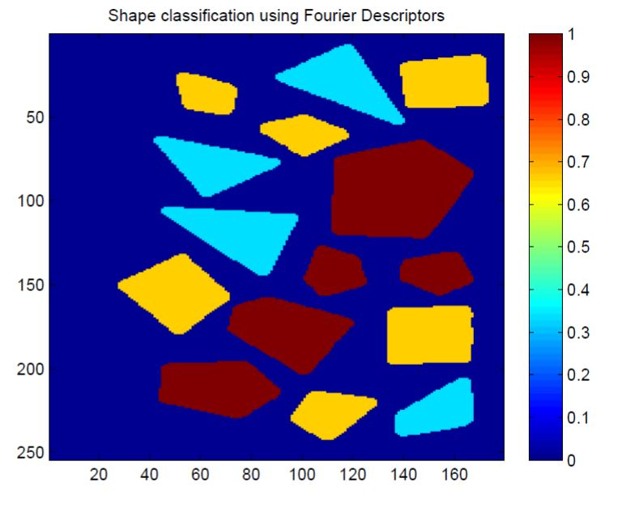
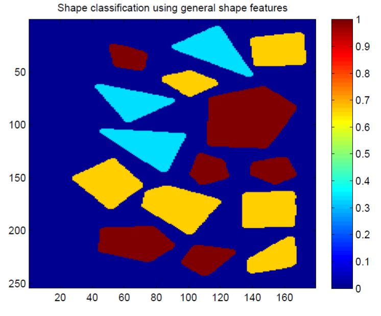

# Shape Recognition with Fourier Descriptors and General Shape Features

## Data:
- Training: There are three different classes of object shapes: triangular shapes (../images/img1.jpg), quadrangular shapes (../images/img2.jpg) and pentagon (../images/img2.jpg) shapes. Each of the three shape classes has 10 samples. 
- Testing: (../images/img4.jpg) 15 objects from all of the above mentioned three classes

## Preprocessing:
1. Thresholding and pre-processing: generate binary images
2. Connected component labeling and fragment removal
3. Boundary tracing

## Feature Extraction:
- Computing Fourier Descriptors 
- Alternative: 6 different general shape features: compactness, rectangularity, circularity, eccentricity, area/perimiter, etc. (General shape features are not robust a lot but it is not bad for classifying simple shapes such as triangular, pentagons, etc.)

## Classifiers:
- Nearest-mean classification

## Results:

